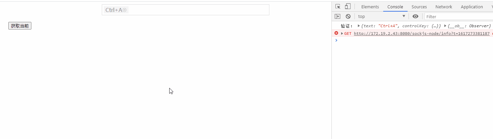

# hot-key-input

> base: https://codesandbox.io/s/vue-hotkeyinput-90m2k



## 项目步骤

```
yarn install
```

### 开发

```shell
# 访问localhost:8080
npm run dev
```


### 发布

```shell
# 修改版本号
npm run upload
```

### issues

See [Issues](https://github.com/shuaninfo/hot-key-input/issues).